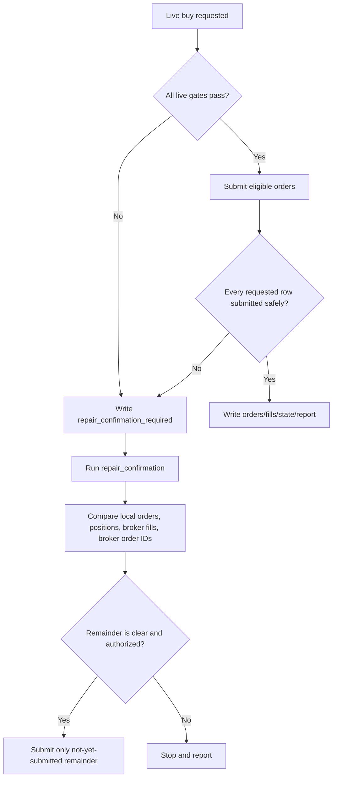

# Engineering Blueprint

這套系統的主題是 execution correctness。

也就是說，重點不是公開展示上游怎麼選股，而是展示下游如何把一份已標準化的交易訊號，安全地轉成 broker order，並且留下可驗證的紀錄。

## End-to-End Flow

```mermaid
flowchart LR
    A["Private upstream signal export"] --> B["SelectionProvider"]
    B --> C["Preselect artifacts"]
    C --> D["Finalizer"]
    D --> E["Final list"]
    E --> F["Sizing"]
    F --> G["Order intents"]
    G --> H["Buy loop / sell loop"]
    H --> I["BrokerAdapter"]
    I --> J["Broker orders and fills"]
    J --> K["Accounting and ledgers"]
    K --> L["Reports"]
    L --> M["Obsidian sync"]
```

## Main Modules

| Layer | Representative files | Responsibility |
| --- | --- | --- |
| Provider boundary | `selection_provider.py`, `providers/*` | Read standardized input without exposing private selection rules. |
| Finalization | `finalizer.py` | Lock a preselect list into a final list only when timing and target date are valid. |
| Sizing | `sizing.py`, `order_planner.py` | Convert selected items into target quantities under weekly budget and hard-budget limits. |
| Broker abstraction | `broker_adapter.py`, `shioaji_client.py` | Separate dry-run broker behavior from live Shioaji submission. |
| Live execution loops | `cli.py`, `order_engine.py`, `live_order_chase.py`, `sell_policy.py` | Handle order submission, quote checks, cutoff logic, and exit preparation. |
| State and accounting | `state_store.py`, `ledger.py`, `accounting.py` | Reconcile orders, fills, positions, strategy lots, realized/unrealized PnL. |
| Safety and repair | `allowed_live_order.py`, `risk_controls.py`, `repair_confirmation.py` | Prevent unauthorized live orders, duplicate buys, and unsafe reruns after partial failures. |
| Reporting | `report_writer.py`, `obsidian_sync.py` | Render daily/weekly reports and keep operating notes synchronized. |

## Time-Based Gates

The system uses time as a safety boundary.

| Gate | Purpose |
| --- | --- |
| 10:00 Asia/Taipei materialization | Prevents the system from locking a stale weekend or pre-market upstream file as the current trading day list. |
| First trading day buy gate | Prevents Tuesday/Wednesday from opening new basket buys from a newly changed source. |
| Last trading day exit gate | Keeps exit execution separate from new buy logic and gives weekly accounting a clear closing point. |
| Sell window gate | Blocks accidental sell submission outside the intended time window. |

## Live Submission Gates

Live trading requires several confirmations at once:

- Config must enable live mode.
- The week must be explicitly approved.
- Weekly budget and hard budget must match the finalized sizing snapshot.
- CLI must request live behavior.
- Live confirmation flag must be present.
- Environment flag `AUTO_TRADE_LIVE=1` must be active.
- Broker account validation must pass.
- The target artifacts must be fresh for the intended trade date.
- Duplicate-buy and broker/local reconciliation checks must pass.

This means a script cannot become live merely because a file exists.

## Artifact Chain

The system deliberately writes intermediate files because each file is a checkpoint.

| Artifact | Why it exists |
| --- | --- |
| `auto_trade_preselect.csv` | Shows what the execution layer received from the upstream signal boundary. |
| `auto_trade_final_list.csv` | Shows what was finalized for this trade date after timing and date checks. |
| `sizing.csv` | Freezes target quantities and budget assumptions. |
| `orders.csv` | Records intended/submitted orders and local order state. |
| `fills.csv` | Records broker fills or dry-run fills. |
| `positions.csv` | Shows strategy positions after reconciliation. |
| `excluded_positions.csv` | Separates broker inventory that does not belong to this strategy. |
| `pnl_snapshots.csv` | Keeps daily accounting explainable. |
| daily / weekly reports | Turns artifacts into an operator-readable narrative. |

## Repair Flow

The repair rule is simple: after a partial live failure, do not directly rerun the same buy command.

This is the main difference between a trading script and a trading system: rerun safety is treated as a first-class feature.

## Source Of Truth

Reports, dashboards, and Obsidian notes are operator interfaces.

They are useful, but they are not the final authority.

When there is disagreement, the decision order is:

1. Actual scripts and guards.
2. Broker/local artifacts.
3. Reports and Obsidian notes.
4. Dashboard/web views.

That rule prevents a pretty page from hiding a state mismatch.
